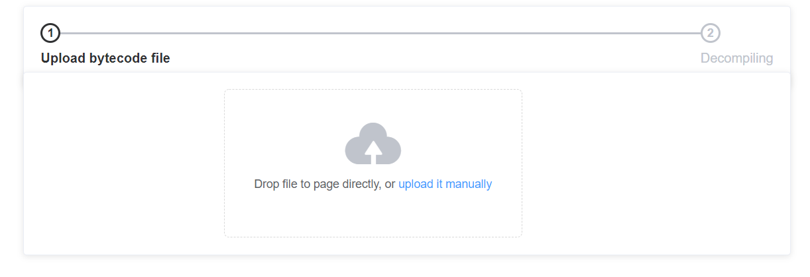
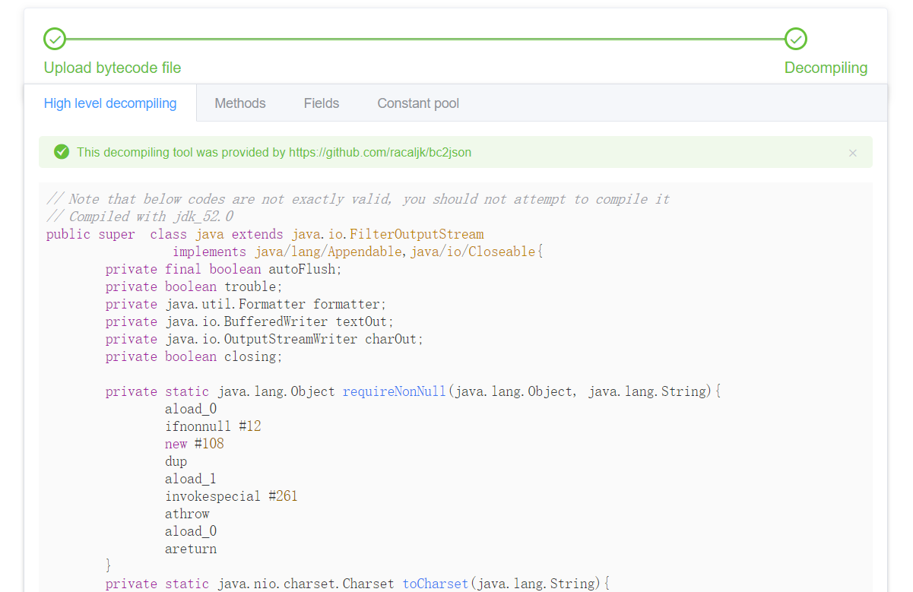
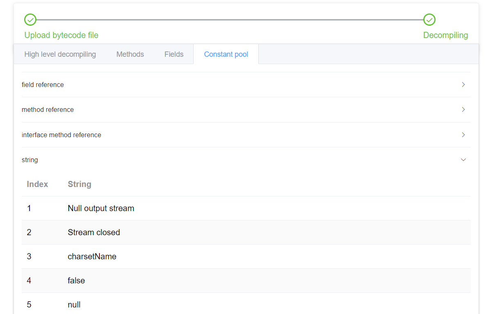
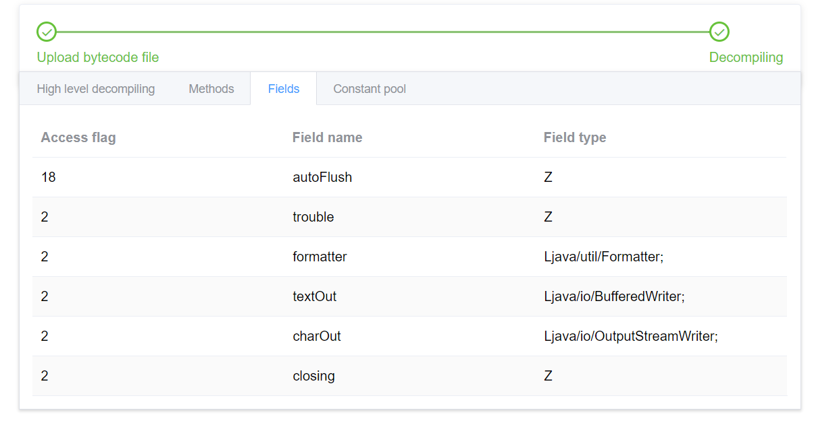

# bytecode-insecptor
This is an online java bytecode inspector, it disassemble bytecode file and
visualizes its content in different levels to satisfy various representing demands.

# Build from source
Actually, you can download prebuilt jar to run it direclty, for those who deeply relies on command line tool user, you can build by **maven** manually.
```bash
$ git clone https://github.com/racaljk/bytecode-inspector.git
$ cd bytecode-inspector
$ mvnw.cmd clean pacakge # for linux user, run mvnw instead
$ cd target
$ java -jar bytecode-insecptor-x.x.x.jar # replace x.x.x with current version
```
When it deployed successfully, you can access `http://localhost:8080/` via a web browser.


# Screenshot






